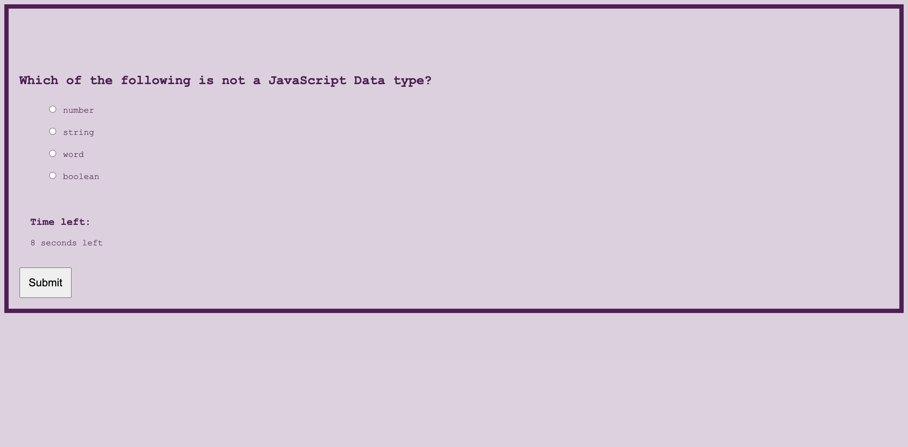

# module-4-javascript-quiz

## Overview

To help coding students study, I created a timed quiz to help them gauge their knowledge on JavaScript.

The quiz includes the elements below:

- Timer
- Form to submit high scores
- "Top Highest Scores" board

## Installation:

1. `git clone git@github.com:PDKetchum/module-4-javascript-quiz.git`
2. Open `index.html`

## How to use:

Selecting Answers:

- Click on the radio next to your selected answer
- Click Submit to move on to next question/page

Incorrect Answers:

- If the answers are incorrect, 10 seconds are deducted from the timer

The quiz is ended by:

- Answering all the questions
- When the timer reaches "0 seconds"

Hosted: https://pdketchum.github.io/module-4-javascript-quiz/

GitHub URL: https://github.com/PDKetchum/module-4-javascript-quiz

## Acknowledgments

Question ideas from:
https://www.guru99.com/javascript-interview-questions-answers.html

_Screenshot of page_
